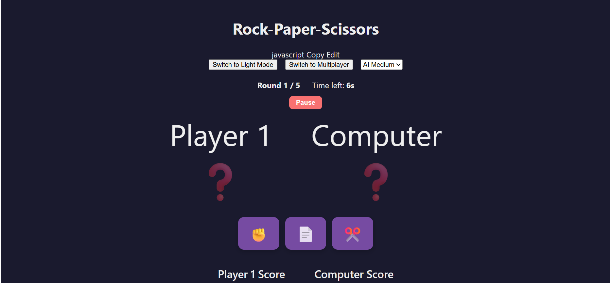
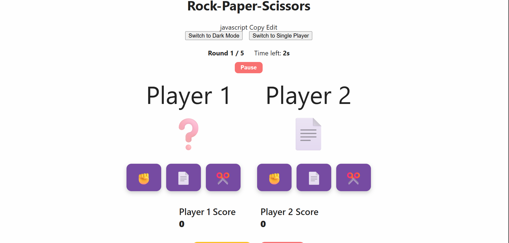
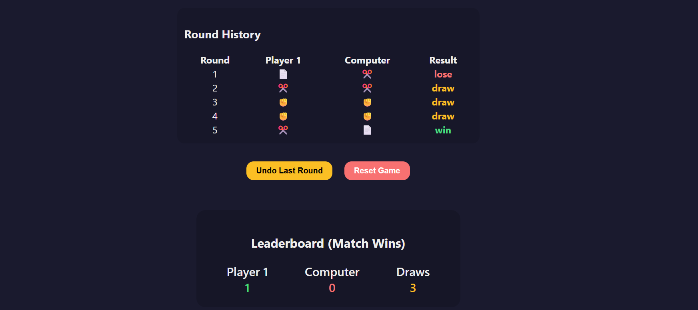

# 🎮 Rock Paper Scissors Game ✂️📄🪨

A polished **Rock-Paper-Scissors** game built with React. This project features:

- 🕹️ Single-player mode (play against the computer)  
- 👥 Two-player mode (play against a friend)  
- 🌗 Dark and Light themes  
- 📊 Game history and leaderboard tracking  
- 📱 Responsive and clean UI  

---

## 📸 Demo Screenshots

### 🕹️ Single Player Mode - Dark Theme  

### 👥 Multiplayer Mode - Light Theme  

### 📊 Game History and Leaderboard  

---

## 🚀 Getting Started

### 🛠️ Prerequisites

- Node.js (v14 or later recommended)  
- npm (comes with Node.js)  

### 📦 Installation

Clone the repo:
git clone https://github.com/Shristirajpoot/Rock_n_Rule.git
cd game
Install dependencies:

npm install
▶️ Running Locally
npm start
This will start the development server. Open http://localhost:3000 to view it in your browser.

###✨ Features
🌗 Dark and Light Modes: Toggle between themes for better accessibility and style preference.

🕹️ Single Player: Play against a computer opponent with randomized moves.

👥 Two Player: Play with a friend on the same device.

📈 Game History: Track your wins, losses, and ties.

🏆 Leaderboard: See top scores and game statistics.

### 🛠️ Technologies Used
⚛️ React.js

🎨 CSS Modules

💻 JavaScript (ES6+)

### 🤝 Contributing
Contributions are welcome! Feel free to open issues or submit pull requests.

###  License
This project is licensed under the MIT License.

### 📬 Contact
Created by Shristirajpoot — feel free to reach out!

